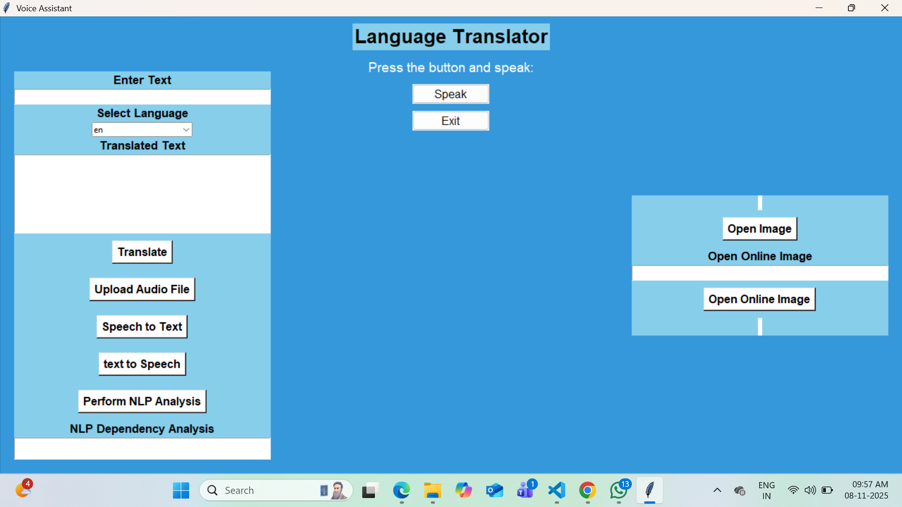

# Multilingual_Translator
A multilingual translator and voice assistant with NLP analysis and image captioning powered by AI.
# Multilingual Translator with NLP and Image Captioning

[](https://www.python.org/)
[](LICENSE)

A **desktop application** that combines **multilingual translation**, **voice assistant features**, **NLP analysis**, and **image captioning** using AI models. Built with **Python** and **Tkinter**.

---

## Features

- **Multilingual Translation:** Translate text between 100+ languages using Google Translate API (`googletrans`)  
- **Text-to-Speech & Speech-to-Text:** Convert text to speech and recognize voice input with `gTTS` and `SpeechRecognition`  
- **NLP Analysis:** Perform dependency parsing and other linguistic analysis using `spaCy`  
- **Image Captioning:** Generate AI captions for images using `VisionEncoderDecoderModel` from `transformers`  
- **Voice Assistant:** Recognize voice commands and perform Google searches  
- **GUI Interface:** Interactive and user-friendly interface using **Tkinter**  
- **Local & Online Images:** Upload images or fetch images from URLs for AI captioning  

---

## Screenshots

**

---

## Installation

```bash
# Clone the repository
git clone https://github.com/Vimal-raj-2004/Multilingual_Translator.git
cd Multilingual-Translator-NLP-ImageAssistant

# Create a virtual environment
python -m venv .venv
.venv\Scripts\activate  # Windows
# source .venv/bin/activate  # Linux/MacOS

# Install dependencies
pip install -r requirements.txt

# Run the application
python multilingual_translator.py
